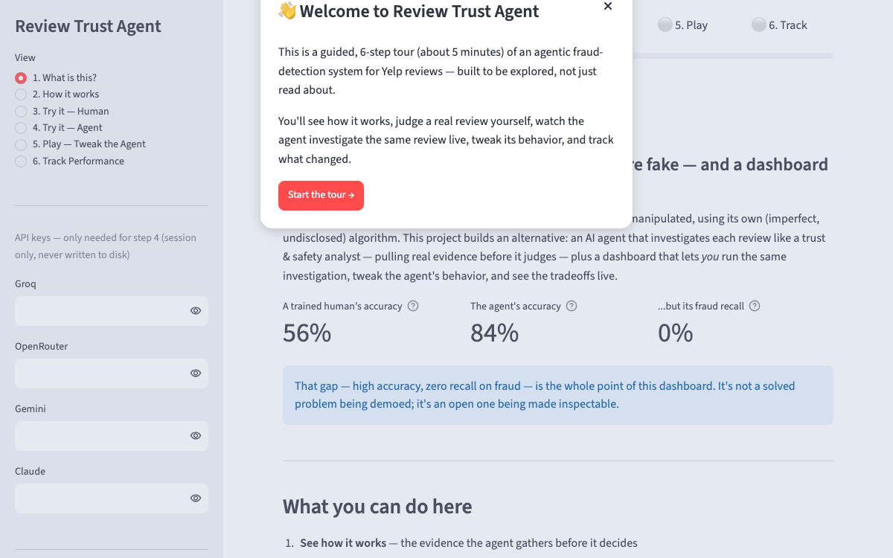

# Review Trust Agent

An AI agent that investigates whether a Yelp review is fake — and a live dashboard
that lets you second-guess it, tweak its behavior, and see the tradeoffs.



**[Try the live dashboard →](https://review-trust-agent.streamlit.app/)**

**The headline finding, reported exactly as found:** in a 50-review real evaluation
batch, the agent scored 84% accuracy — but **0% recall on actual fraud**, missing every
one of the 6 real fake reviews in that batch. On this class-imbalanced task, a trivial
"always guess genuine" baseline scores 88% — *higher* than the careful, evidence-weighing
agent, while doing zero actual work. That gap is the whole point of this project: this is
a rigorously evaluated system with a real, actionable failure mode, not a polished demo
of a solved problem.

- **[Read the full product case study](PRODUCT_CASE_STUDY.md)** — business problem,
  hypothesis, users & JTBD, scope & tradeoffs, evaluation plan, top risks.
- **[Read the narrative case study](CASE_STUDY.md)** — the autonomy policy, three real
  hard-case walkthroughs, the ground-truth caveat, and the Uber cross-domain argument.
- **[Read the full build decision log](PROCESS.md)** — every architectural and product
  decision made during the build, in ADR-lite format.

This dashboard is a real Streamlit app running real Python — not a mockup. Every
number, chart, and control is wired to a real computation (see "What's real vs. scoped
down" below).

## Try it

- **Human Review** and **System Config** and **Performance Tracking** work
  immediately, no API key needed.
- **Agent Review** (the live agent) needs your own API key for one provider —
  paste it in the sidebar (session-only, never stored). Get a free key in
  under a minute: [Groq console](https://console.groq.com/keys) (the default
  configured provider) or [OpenRouter](https://openrouter.ai/keys).

## What's real vs. scoped down for this public demo

- **Real:** every tool call (reviewer history, business trend, text
  similarity), every LLM call, every judgment, every config deploy — all
  running against genuine Yelp review data (the
  [YelpZip](https://odds.cs.stonybrook.edu/yelpzip-dataset/) research
  dataset).
- **Scoped down:** the full dataset is 608K reviews (~400MB) — too large for
  a public GitHub repo. This demo ships a trimmed index: every review in the
  5,000-review evaluation sample, plus each of those reviewers'/businesses'
  most recent real history (up to 40 other reviews per reviewer, 60 per
  business). It's genuine data throughout, just capped in volume rather than
  full-dataset scale — see `scripts/data_index.py`.
- **Not persistent:** this runs on Streamlit Community Cloud's free tier,
  which has an ephemeral filesystem. New judgments you log and new config
  versions you deploy will reset if the app restarts (goes to sleep after
  inactivity, or redeploys). The seeded historical baselines (56% human
  accuracy, 84% agent accuracy from the original project) always reload on
  restart since they come from the checked-in CSVs.

## Run it locally instead

```bash
pip install -r requirements.txt
streamlit run dashboard/app.py
```
